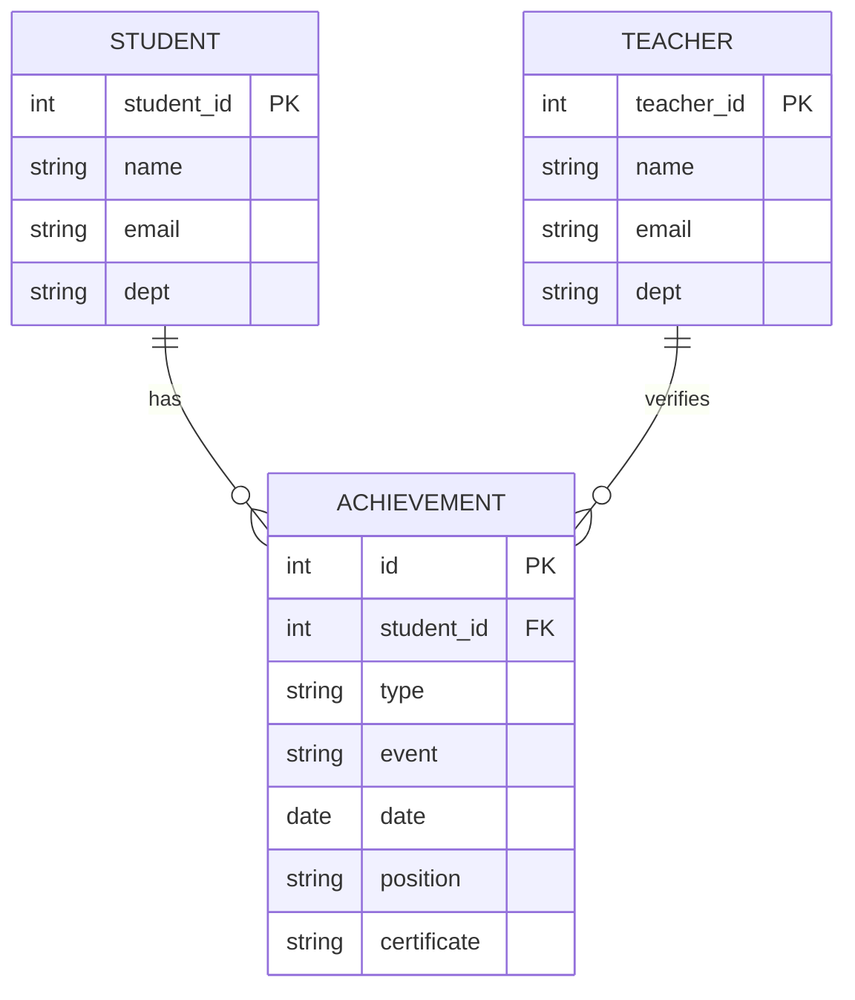
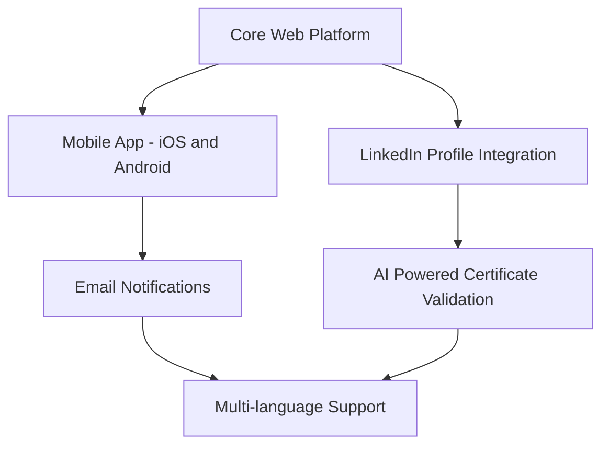

# Achievement Management System

A web-based platform that helps academic institutions centrally manage and track student achievements.  
Students can view and analyze their accomplishments, while teachers can easily record and manage them — all in one organized system.

---

## Overview

Academic achievements are often scattered across certificates, spreadsheets, emails, and physical records. This makes it difficult for students to showcase their work during placements or applications and time-consuming for teachers to manage records.

The **Achievement Management System** solves this by providing a centralized dashboard where:
- Students can view, filter, and analyze their achievements
- Teachers can efficiently record and manage student accomplishments
- Institutions get a structured, reliable record of academic progress

This project is intended for **academic institutions**, students, and faculty members.

---

## Features

- Centralized achievement tracking
- Role-based dashboards for students and teachers
- Certificate upload and access
- Advanced filtering and analytics
- Clean and responsive user interface
- Dark / light mode support

---

## Tech Stack

- **Flask** – Python web framework
- **SQLite** – Lightweight relational database
- **JavaScript** – Client-side interactivity
- **HTML / CSS** – Responsive UI
- **Jinja2** – Server-side templating

---


## Project Structure

``` text
achievement-management-system/
├── app.py              # Main Flask application and routes
├── init_db.py          # Database initialization script
├── requirements.txt    # Python dependencies
├── static/
│   ├── css/            # Styles and themes
│   ├── js/             # Client-side scripts
│   └── certificates/   # Uploaded certificate files
├── templates/          # HTML templates
├── database/           # SQLite database files
├── README.md
└── CONTRIBUTING.md

```

## Prerequisites

Before setting up the project, ensure you have:

• Python 3.9 or later

• pip

• git

Note: No environment variables are required for local development by default.

## Quick Start

### Windows (PowerShell)

```powershell

# Clone repository

git clone https://github.com/<org-or-username>/achievement-management-system.git
cd achievement-management-system

# Create virtual environment

python -m venv venv
venv\Scripts\activate


# Install dependencies

pip install -r requirements.txt

# Initialize database

python init_db.py

# Run application

python app.py

```

### macOS / Linux

```bash

# Clone repository
git clone https://github.com/yourusername/achievement-management-system.git
cd achievement-management-system

# Create virtual environment
python3 -m venv venv
source venv/bin/activate

# Install dependencies
pip install -r requirements.txt

# Initialize database
python init_db.py

# Run application
python app.py

```
Once running, open:

👉 http://localhost:5000


## Core Functionality

### Student Features

• Personal dashboard with all achievements

• Achievement analytics and progress tracking

• Search and filter by type, year, or position

• Download uploaded certificates

• Profile management

### Teacher Features

• Quick achievement entry forms

• Student search with auto-complete

• Certificate uploads (PDF, JPG, PNG up to 5MB)

• Batch management of records
 
• Basic analytics for recorded entries

### Supported Achievement Types

• Hackathons

• Coding competitions

• Paper presentations

• Conferences

• Symposiums

• Custom academic events

Each category supports structured metadata such as event name, date, position, and descriptions.


## Database Design



## Running Tests

Automated tests are not yet configured.
Contributions adding test coverage are welcome.

## Contributing

Contributions are welcome and encouraged!

Please read CONTRIBUTING.md before submitting a pull request.

If you’re new to the project, starting with documentation or small issues is a great way to get involved.

## Roadmap

## 🛣️ Project Roadmap



## License

This project is developed for academic purposes at
SRM Institute of Science and Technology.

License details will be added in the future.

## Contact & Support

• Report issues or request features via GitHub Issues

• Contributions and discussions are always welcome


